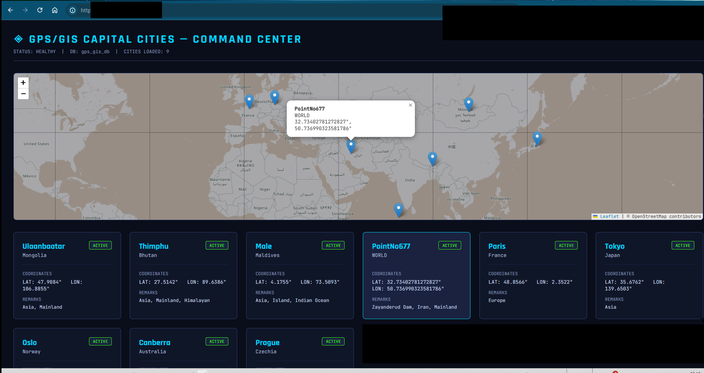
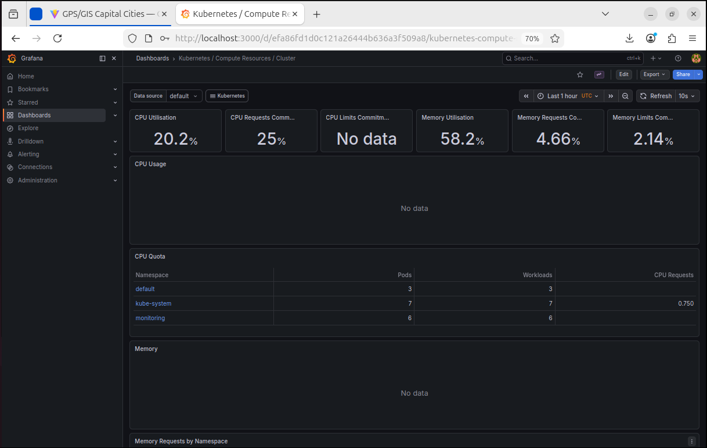
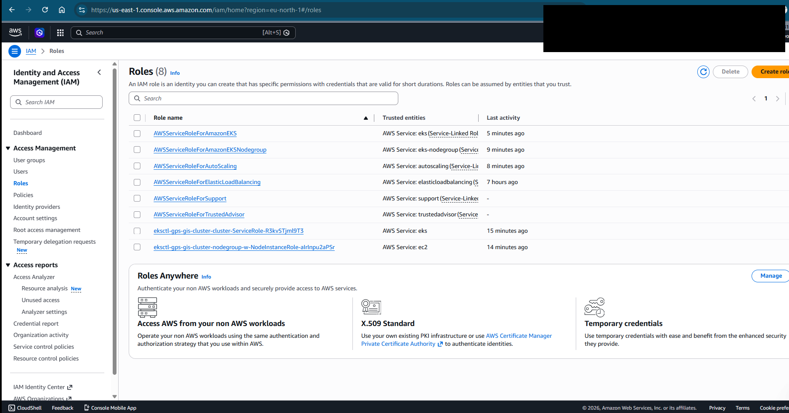

# gps-gis-devops-project

DevOps portfolio: GPS/GIS microservices with full CI/CD on AWS EKS

# GPS/GIS DevOps Portfolio Project

A full-stack GPS/GIS application tracking capital cities and geographical points of interest around the world, built as a DevOps portfolio project demonstrating the complete modern DevOps toolchain.

## 🌍 Live Features

- Interactive world map with clickable markers for capital cities and special interest locations
- Expandable location cards showing coordinates and plain-language remarks
- Active/Passive toggle — show or hide any location on the map instantly
- Alphabetical sort and real-time search across all tracked points
- Any geographical point on Earth can be marked, tracked, and given plain-language remarks — demonstrated by a dam in Iran included as a real-world example

## 📸 Screenshots

### Application Map


### Grafana Monitoring Dashboard


### AWS Deployment


### Argo CD — GitOps Dashboard


### Jenkins — CI/CD Pipeline


## 🛠️ Tech Stack

| Layer | Technology |
|-------|-----------|
| Backend | Python FastAPI + PostgreSQL |
| Frontend | React + Vite + Leaflet Maps |
| Containerization | Docker + Docker Compose |
| CI/CD | Jenkins Pipeline |
| Orchestration | Kubernetes (minikube + AWS EKS) |
| Cloud | AWS EKS + ECR |
| Infrastructure as Code | Terraform |
| GitOps | Argo CD |
| Monitoring | Prometheus + Grafana (Helm) |

## 📊 Monitoring

Prometheus and Grafana deployed via Helm into a dedicated `monitoring` namespace.
Access Grafana dashboard:
```bash
kubectl port-forward -n monitoring svc/monitoring-grafana 3000:80
# Open http://localhost:3000
```

## ⚙️ CI/CD — Jenkins

Jenkins runs in Docker, executing a 3-stage pipeline on every build:
- **Checkout** — pulls latest code from GitHub
- **Test** — runs pytest via Docker (3 DB-independent tests)  
- **Build** — builds gps-backend and gps-frontend Docker images

Access Jenkins:
```bash
docker start jenkins
# Open http://localhost:8090
```

## 🔄 GitOps / Argo CD

Argo CD deployed to Kubernetes, watching the `kubernetes/` folder in this repo.
Any push to `main` automatically syncs the live cluster — true GitOps. 🔄

Access Argo CD dashboard:
```bash
kubectl port-forward svc/argocd-server -n argocd 8080:443
# Open https://localhost:8080
# Username: admin
```

## 🏗️ Architecture
```
Developer → GitHub → Jenkins CI/CD → Docker Images → Kubernetes → AWS EKS
                          ↓
                      Argo CD (GitOps auto-sync)
                          ↓
          React Frontend + FastAPI Backend + PostgreSQL
                          ↓
              Prometheus + Grafana (Monitoring)
```


## 🚀 Quick Start

### Run with Docker Compose
```bash
cd docker
docker-compose up
# Open http://localhost:5173
```

### Run with Kubernetes (minikube)
```bash
minikube start --driver=docker
eval $(minikube docker-env)
docker build -t gps-backend:latest ./backend
docker build -t gps-frontend:latest ./frontend
kubectl apply -f kubernetes/
minikube service frontend-service --url
```

## 📊 API Endpoints

| Method | Endpoint | Description |
|--------|----------|-------------|
| GET | /health | Health check |
| GET | /api/capitals | Get all cities |
| GET | /api/capitals/{id} | Get one city |
| POST | /api/capitals | Create city |
| PUT | /api/capitals/{id} | Update city |
| DELETE | /api/capitals/{id} | Delete city |

## 🧪 Tests
```bash
cd backend
pytest tests/ -v
```
7/7 tests passing ✅


## 🗺️ Future Roadmap

### Coming Next
| Enhancement | Description |
|-------------|-------------|
| **Image Scanning** | Trivy security scanning integrated into Jenkins pipeline |
| **RBAC** | Role-based access control with least-privilege principles |
| **Network Policies** | Pod-level network security and traffic control |

> *"A good DevOps engineer never stops improving the pipeline."*


## 👤 Author
**DevOps-ily** — Built from scratch in under 2 weeks, under missile attacks, because nothing stops a DevOps engineer. 加油! 💙
